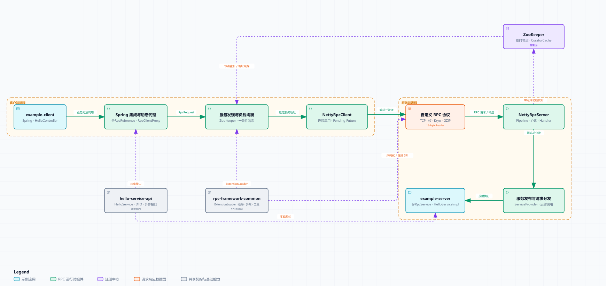

# Flower-RPC

[简体中文](README.md) | **English**

Flower-RPC is an educational RPC framework for learning RPC fundamentals and Java network programming. It follows the complete lifecycle of a remote invocation, including service publication, dynamic proxies, service discovery, load balancing, protocol codecs, network transport, and response delivery.

> [!IMPORTANT]
> This project is still under development and has not been fully validated for production use. Do not use it directly in production systems.

<p align="center">
  <a href="docs/architecture/flower-rpc-architecture.html">
    
  </a>
</p>

## Architecture

- [Open the interactive architecture diagram](docs/architecture/flower-rpc-architecture.html) (clone or download the repository and open it in a browser)
- [View the Archify architecture specification](docs/architecture/flower-rpc-architecture.json)

Default invocation path:

```text
Spring Bean
  -> @RpcReference / JDK dynamic proxy
  -> ZooKeeper discovery / consistent hashing
  -> Netty client / custom RPC protocol
  -> Netty server / reflective invocation
  -> RpcResponse / CompletableFuture
```

ZooKeeper is the service-registration and discovery control plane; it does not carry RPC request or response payloads. Business data travels through Netty or the replaceable Socket transport.

## Features

- Spring scanning, service publication, and proxy injection with `@RpcService` and `@RpcReference`
- Synchronous interfaces and asynchronous calls backed by `CompletableFuture`
- Netty NIO persistent connections, connection reuse, request timeouts, heartbeats, and graceful shutdown
- A 16-byte protocol header, frame splitting, message codecs, and request-response correlation
- ZooKeeper/Curator service registration and discovery, with a file-based alternative
- Consistent-hash and random load balancing
- JDK, Kryo, Protostuff, and Hessian serialization
- GZIP and no-compression modes
- An SPI extension system based on `ExtensionLoader` and `META-INF/extensions`
- Unit tests, a local Netty end-to-end test, and a benchmark module

## Modules

| Module | Responsibility |
| --- | --- |
| `rpc-framework-common` | SPI loading, shared enums, exceptions, utilities, and thread-pool infrastructure |
| `rpc-framework-simple` | Core proxy, configuration, Spring integration, registry, discovery, load balancing, protocol, serialization, and transport implementation |
| `hello-service-api` | Service interfaces, asynchronous interfaces, and DTOs shared by the client and server |
| `example-server` | `@RpcService` publication and Netty server example |
| `example-client` | `@RpcReference` injection and synchronous/asynchronous invocation example |
| `flower-rpc-benchmark` | Throughput, latency, and connection tests over the real RPC path |

The root-level `flower-rpc-framework` directory is not currently part of the Maven reactor. The six modules listed above are the modules declared by the root `pom.xml`.

## Default Stack

- Java 25 and Maven 3.9+
- Spring Framework 7
- Netty 4.2
- Apache Curator and ZooKeeper
- Kryo as the default serializer and consistent hashing as the default load balancer
- JUnit 6 and HdrHistogram

Example configuration files:

- [`example-server/src/main/resources/flower-rpc.properties`](example-server/src/main/resources/flower-rpc.properties)
- [`example-client/src/main/resources/flower-rpc.properties`](example-client/src/main/resources/flower-rpc.properties)

Configuration precedence is: JVM `-D` properties > `flower-rpc.properties` > framework defaults.

## Quick Start

### 1. Requirements

- JDK 25+
- Maven 3.9+
- Docker and Docker Compose for the default ZooKeeper instance

### 2. Start ZooKeeper

```bash
docker compose up -d zookeeper
```

The default address is `127.0.0.1:2181`. Check its status with:

```bash
docker compose ps
```

### 3. Build and Test

```bash
mvn clean verify
```

### 4. Run the Examples

Run these entry points from your IDE, in order:

1. `com.github.hgdcoder.server.ServerMain`
2. `com.github.hgdcoder.client.ClientMain`

By default, the server listens on `0.0.0.0:9998` and publishes `127.0.0.1:9998` to ZooKeeper. The client discovers the endpoint and invokes `HelloService`.

### 5. Stop the Infrastructure

```bash
docker compose down
```

## Extension System

The framework loads implementations through `@SPI`, `ExtensionLoader`, and `META-INF/extensions`. To add an implementation, implement the corresponding interface and register its mapping in the resources directory. Current extension points include:

- `RpcRequestTransport`
- `ServiceRegistry` / `ServiceDiscovery`
- `LoadBalance`
- `Serializer`
- `Compress`

## Scope and Attribution

This project follows the architecture, module layout, and implementation approach of [Snailclimb/guide-rpc-framework](https://github.com/Snailclimb/guide-rpc-framework) as a step-by-step learning exercise. It is not an independently originated RPC framework, and it has not yet undergone systematic differentiation or feature expansion.

Flower-RPC is intended solely for learning and technical discussion and has no official affiliation with the upstream author. Upstream code and related rights belong to their respective authors and contributors.

## License

This repository includes the [Mulan Permissive Software License, Version 1](LICENSE). When using or distributing the project, also follow the upstream project's license and attribution requirements.
